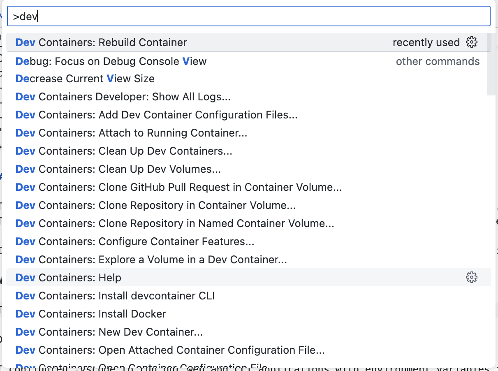

# Task

Implement a QuickTime Movie command line file parser that can print to the console the width & height of any video content present, 
and the sample rate of any audio content present.

## Requirements

- The code should be written in the language of your choice, should not make use of any external libraries that are parsing QuickTime / MPEG-4 files.  Do not take any existing parsers found on the Internet.
- The command line tool should take a file path and output (to the console) the width & height of all video tracks found, and the sample rate of all audio tracks found.  If you wish to output more information about the file, feel free but it is not required.
- Your tool does not need a graphical user interface.
- Efficiency is important; do not scan the entire file byte by byte searching for known values.
- Your tool does not need to handle compressed movie resources.

# Disclaimer

😅 I spent a significant amount of time learning the mp4 format, which took up 80% of the project time.

😆 I wrote tests and verified the code on 10 public mp4 videos. It's not enterprise, but it parses a couple of formats without issues. 

And yes, the tool does handle compressed movie resources :-(

Despite the request to avoid libraries, I included:

- logrus for log output formatting

🧑‍💻 I also added:
- .devcontainer
- Docker build
- GitHub actions
- Lint
- Tests

💣 This is the **minimum** working version.

😈 I wrote tests for 4 videos and included them in the git repository. It's not the best practice. Usually, they're hosted on S3 with a make command for downloading.

```bash 
$ make run
 
file: ./cmd/cli/clouds.mp4
video: 720 486

file: ./cmd/cli/dji.mp4
video: 1920 1080
audio: 44100 hz
```

# Dev

## Prerequisites

- Install [Visual Studio Code](https://code.visualstudio.com/).
- Install [Docker](https://www.docker.com/products/docker-desktop) on your machine.
- Install the [Remote - Containers](https://marketplace.visualstudio.com/items?itemName=ms-vscode-remote.remote-containers) extension in VSCode.



## Setting Up a Dev Container

1. **Open your project in VSCode:** Start by opening the folder containing your project in VSCode.

2. **Reopen in Container:**
   - Once your configuration is in place, reopen your project in the container.
   - Use the command palette (`F1` || `cmd` + `shift` + `p`) and select `Remote-Containers: Reopen in Container`.

3. **Wait for the Container to Build:** 
   - VSCode will build the container based on your configuration. This might take a few minutes.

## Tests

```bash
make test
```

## Run

```bash
make run
```

or `cmd` + `r` (by vscode launch ./vscode)
